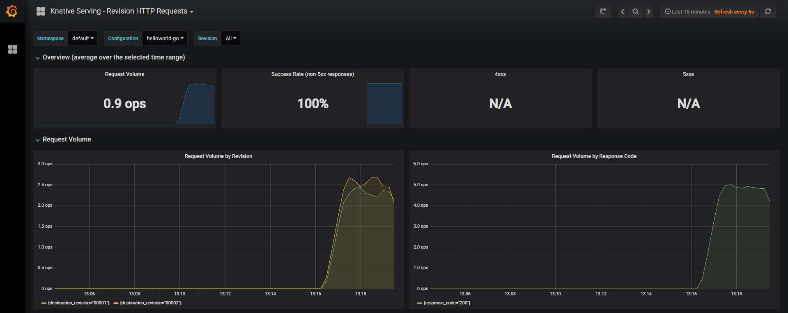
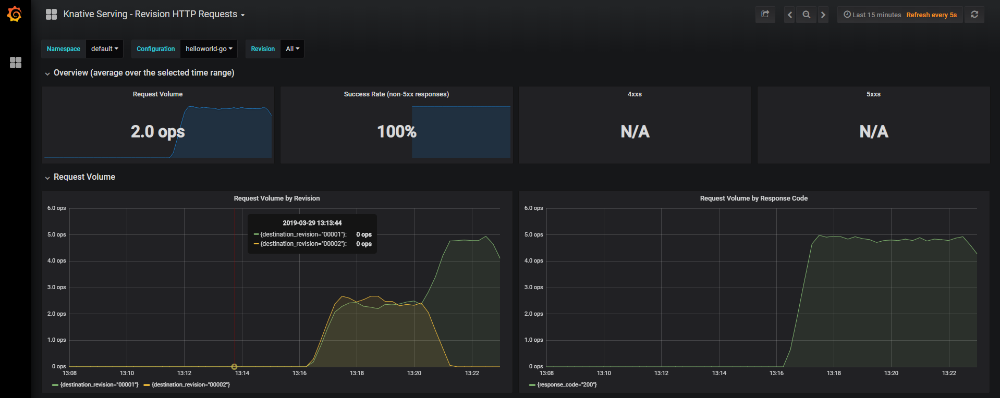
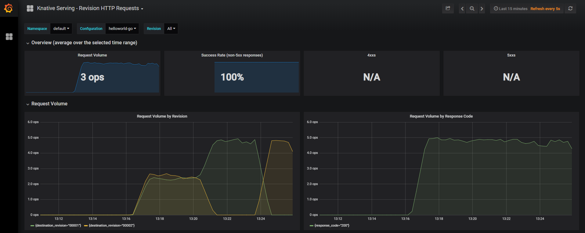

# Knative routing

[Knative](https://github.com/knative/docs) is an open source platform that extends the capabilities of Kubernetes to help you create modern, source-centric containerized and serverless applications.
Knative integrates with Istio to ensure that your workloads can be easily exposed on the internet, monitored and controlled.
This lab focuses on these traffic management capabilities of Knative.


## Objectives

In this lab you'll learn
* How to roll out a new revision of an application
* How to roll back to an earlier revision of an application


## Prerequistes

This lab assumes that you have completed the [Knative Workshop](https://github.com/IBM/knative101/tree/master/workshop),
which introduces the basic Knative concepts and provides instructions for creating an IBM Kubernetes Service cluster and installing Knative.
You will need the cluster to complete this lab.
Complete the following exercises in the workshop if you have not already done so:
* [Install developer tools (ibmcloud, kubectl, knctl)](https://github.com/IBM/knative101/tree/master/workshop/exercise-0)
* [Create a Kubernetes cluster on IBM Cloud](https://github.com/IBM/knative101/tree/master/workshop/exercise-1)
* [Set up your private container registry](https://github.com/IBM/knative101/tree/master/workshop/exercise-2)
* [Install knative and istio on your cluster](https://github.com/IBM/knative101/tree/master/workshop/exercise-3)


## Deploy the sample application

A user can work with Knative in two different ways:
* the user can manage the low-level Knative resources (route, configuration, etc.) directly, or
* the user can manage the high-level Knative service resource and let Knative managed the underlying low-level resources

For the purpose of getting started and keeping things simple, let's assume that we are using the latter approach.

This lab uses a helloworld sample program that was adapted from [this sample](https://github.com/knative/docs/tree/master/docs/serving/samples/helloworld-go).

Clone this repository so that you can use the yaml files in it.

```
git clone github.com/IBM/knative-routing-tutorial
```

In the Knative lab you learned how to use the kaniko build template to build a container image from a Dockerfile.
If you didn't already do so in the lab, install the kaniko build template to your cluster.

```
kubectl apply --filename https://raw.githubusercontent.com/knative/build-templates/master/kaniko/kaniko.yaml
```

We're going to deploy the helloworld program using the [helloworld1.yaml](helloworld1.yaml) file.
Let's take a look at the file.

```
apiVersion: serving.knative.dev/v1alpha1
kind: Service
metadata:
  name: helloworld-go
  namespace: default
spec:
  runLatest:
    configuration:
      build:
        apiVersion: build.knative.dev/v1alpha1
        kind: Build
        spec:
          serviceAccountName: build-bot
          source:
            git:
              url: https://github.com/IBM/knative-routing-tutorial.git
              revision: master
          template:
            name: kaniko
            arguments:
            - name: IMAGE
              value: registry.ng.bluemix.net/<NAMESPACE>/helloworld-go:1
            - name: DOCKERFILE
              value: /workspace/helloworld1/Dockerfile
      revisionTemplate:
        spec:
          serviceAccountName: build-bot
          container:
            image: registry.ng.bluemix.net/<NAMESPACE>/helloworld-go:1
            env:
            - name: TARGET
              value: "Go Sample v1"
```

The yaml file uses kanako to build the application from source code in the git repository and push the built container image to a private container registry.
Then it pulls the container from the registry to run it.

You must edit the helloworld1.yaml file to point to your own container registry namespace by replacing instances of <NAMESPACE> with the container registry namespace you created in the Knative lab.
After you do that, apply the helloworld1.yaml file to your cluster.

```
kubectl apply -f helloworld1.yaml
```

It may take a few minutes for the build process to run and for the program to be ready.
You can monitor the progress by displaying the service.

```
kubectl get ksvc helloworld-go
```

When the output shows the service is ready, you can continue.

```
NAME            DOMAIN                                                                 LATESTCREATED         LATESTREADY           READY     REASON
helloworld-go   helloworld-go.default.mycluster6.us-south.containers.appdomain.cloud   helloworld-go-00001   helloworld-go-00001   True      
```

The above output tells us that the service hostname is
<br/>
&nbsp;&nbsp;`helloworld-go.default.mycluster6.us-south.containers.appdomain.cloud`.

The hostname for the service follows this general pattern:
<br/>
&nbsp;&nbsp;*service-name*.*service-namespace*.*ingress-subdomain*

The *service name* and *service-namespace* are determined from the service yaml file.
In this case the yaml did not specify a namespace and so the `default` namespace is used.

The *ingress subdomain* is a public URL providing access to your cluster. 
You may see a different name depending on what you named your cluster and where it is located.

Now you can curl the helloworld application.  Substitute your service name in the curl command below.

```
curl helloworld-go.default.mycluster6.us-south.containers.appdomain.cloud
```

You should see a response message `Hello Go Sample v1!`


## Roll out of a new version of the application

Let's change the sample application to give back a more interesting response than the simple static message.
We could just build a new image and deploy it, completely replacing the old version of the application.
However at a certain point you may want to do a more gradual roll out of a new function to users.
This can be done using what's called "release" mode in the service yaml file.

Here is the next yaml file we will use, [helloworld2.yaml](helloworld2.yaml).

```
apiVersion: serving.knative.dev/v1alpha1
kind: Service
metadata:
  name: helloworld-go
  namespace: default
spec:
  release:
    # Ordered list of 1 or 2 revisions. 
    # First revision is traffic target "current"
    # Second revision is traffic target "candidate"
    revisions: ["helloworld-go-00001", "helloworld-go-00002"]
    rolloutPercent: 50 # Percent [0-99] of traffic to route to "candidate" revision
    configuration:
      build:
        apiVersion: build.knative.dev/v1alpha1
        kind: Build
        spec:
          serviceAccountName: build-bot
          source:
            git:
              url: https://github.com/IBM/knative-routing-tutorial.git
              revision: master
          template:
            name: kaniko
            arguments:
            - name: IMAGE
              value: registry.ng.bluemix.net/<NAMESPACE>/helloworld-go:2
            - name: DOCKERFILE
              value: /workspace/helloworld2/Dockerfile
      revisionTemplate:
        spec:
          serviceAccountName: build-bot
          container:
            image: registry.ng.bluemix.net/<NAMESPACE>/helloworld-go:2
```

In addition to changing the service's pod configuration to build and use a different image,
this file uses "release" in place of "runLatest" from the previous yaml file.
The release mode lets us provide the following:
* A list of two revisions to divide traffic between.
In this case we want to divide traffic between the previous revision `helloworld-go-00001` and the new revision we're creating `helloworld-go-00002`.
* A percentage of traffic to route to the second revision in the above list.  In this case we're directing 50% of the traffic to the new revision.

You must edit the helloworld2.yaml file to point to your own container registry namespace by replacing instances of <NAMESPACE> with the container registry namespace you created in the Knative lab.
After you do that, apply the helloworld2.yaml file to your cluster.

```
kubectl apply -f helloworld2.yaml
```

Watch for the new revision to become ready using `kubectl get ksvc helloworld-go` as before.
When it is, confirm that the route is splitting traffic between the two revisions using

```
knctl route list
```

You should see something like this:

```
Routes in namespace 'default'

Name           Domain                                                                Traffic                     Annotations  Conditions  Age
helloworld-go  helloworld-go.default.mycluster6.us-south.containers.appdomain.cloud  50% -> helloworld-go-00001  -            3 OK / 3    15m
                                                                                     50% -> helloworld-go-00002
                                                                                     0% -> helloworld-go
```

Try using curl again several times and you should see the response you saw from the first version and some new responses.

```
$ curl helloworld-go.default.mycluster6.us-south.containers.appdomain.cloud
Hello and have a wonderful day!

$ curl helloworld-go.default.mycluster6.us-south.containers.appdomain.cloud
Hello Go Sample v1!
```

### Monitoring traffic using Grafana

The Knative installation includes Prometheus and Grafana.
Prometheus is an open-source monitoring tool that can scrape and store multi-dimensional time series data.
Grafana is a metrics analysis platform which allows you to visualize your metrics data through graphs and dashboards.
We can use these tools to observe the traffic being split between the two revisions of the service.

To open Grafana, enter the following command:

```
kubectl port-forward --namespace knative-monitoring \
$(kubectl get pods --namespace knative-monitoring \
--selector=app=grafana --output=jsonpath="{.items..metadata.name}") \
3000
```

This starts a local proxy of Grafana on port 3000.
Navigate to the Grafana UI at <http://localhost:3000>.

When the page opens, click on the dashboard selection drop-down menu at the top of the screen and select
`Knative Serving - Revision HTTP Requests`.
When that dashboard opens, click on the `Configuration` drop-down menu and select `helloworld-go`.

In a separate shell, run a loop of curl requests to the `helloworld-go` service as follows.

```
for i in `seq 1 5000`; do curl helloworld-go.default.mycluster6.us-south.containers.appdomain.cloud; done
```

You should see traffic being split evenly between revisions 1 and 2 in the `Request Volume By Revision` dashboard.



Keep the grafana window open since we'll return to it later in the tutorial.

### Additional service hostnames in release mode

When using the service release mode, additional service hostnames are created for accessing specific revisions.
You can see these hostnames by using the following command.

```
knctl route show --route helloworld-go
```

You should see output similar to the following.

```
Route 'helloworld-go'

Name             helloworld-go
Domain           helloworld-go.default.mycluster6.us-south.containers.appdomain.cloud
Internal Domain  helloworld-go.default.svc.cluster.local
Age              1h

Targets

Percent  Revision             Service  Domain
50%      helloworld-go-00001  -        current.helloworld-go.default.mycluster6.us-south.containers.appdomain.cloud
~        helloworld-go-00002  -        candidate.helloworld-go.default.mycluster6.us-south.containers.appdomain.cloud
0%       helloworld-go-00002  -        latest.helloworld-go.default.mycluster6.us-south.containers.appdomain.cloud

Conditions

Type                Status  Age  Reason  Message
AllTrafficAssigned  True     1h  -       -
IngressReady        True     1h  -       -
Ready               True     1h  -       -
```

These subdomains have been added:
* `current`, which routes to the first revision in the revision list (helloworld-go-00001 in this case)
* `candidate`, which routes to the second revision in the revision list (helloworld-go-00002 in this case)
* `latest`, which routes to the latest revision of the service (happens to also helloworld-go-00002 in this case)

You can use these hostnames if you need to try out a specific revision.

```
$ curl current.helloworld-go.default.mycluster6.us-south.containers.appdomain.cloud
Hello Go Sample v1!
$ curl candidate.helloworld-go.default.mycluster6.us-south.containers.appdomain.cloud
Hello and have a super day!
```

### Roll back to an earlier version of the application

What if you discover during your roll out testing that there's something wrong with the new revision of your service and you don't want to route users to it?
In that case you can edit the service using 

```
kubectl edit ksvc helloworld-go
```

An edit window appears containing the service's current yaml definition.  Find the key `rolloutPercent` and change it to 0.  Save the file.

All traffic will be routed to the first revision in the revision list.

```
$ curl helloworld-go.default.mycluster6.us-south.containers.appdomain.cloud
Hello Go Sample v1!

$ curl helloworld-go.default.mycluster6.us-south.containers.appdomain.cloud
Hello Go Sample v1!
```

In your grafana window you should see traffic shift completely to revision 1.



### Roll forward to latest version of the application

What if testing went well and you want to route all users to the new revision?
In that case you can edit the service's yaml and change the revisions list and rolloutPercent from this:

```
    revisions:
    - helloworld-go-00001
    - helloworld-go-00002
    rolloutPercent: 50
```

to this:

```
    revisions:
    - helloworld-go-00002
    rolloutPercent: 0
```

All traffic will be routed to the latest revision of the service.

```
$ curl helloworld-go.default.mycluster6.us-south.containers.appdomain.cloud
Hello and have a wonderful day!

$ curl helloworld-go.default.mycluster6.us-south.containers.appdomain.cloud
Hello and have a super day!
```

In your grafana window you should see traffic shift completely to revision 2.

