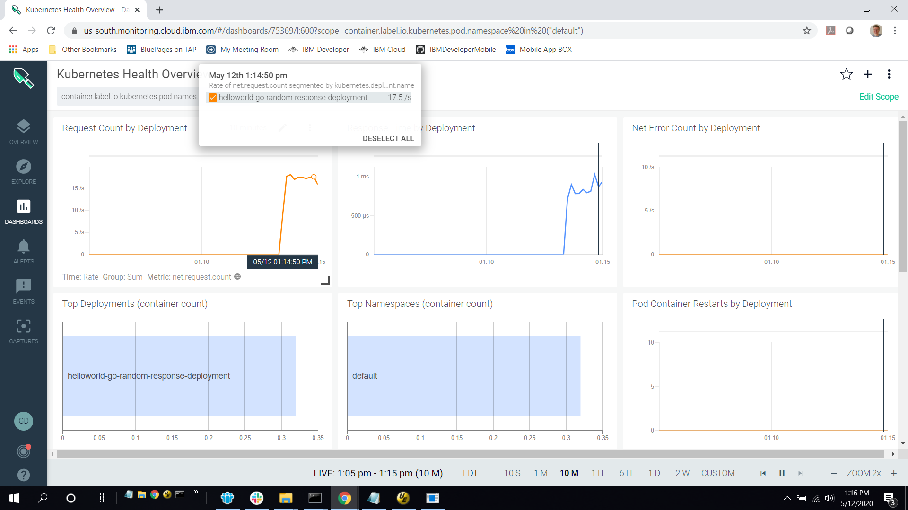
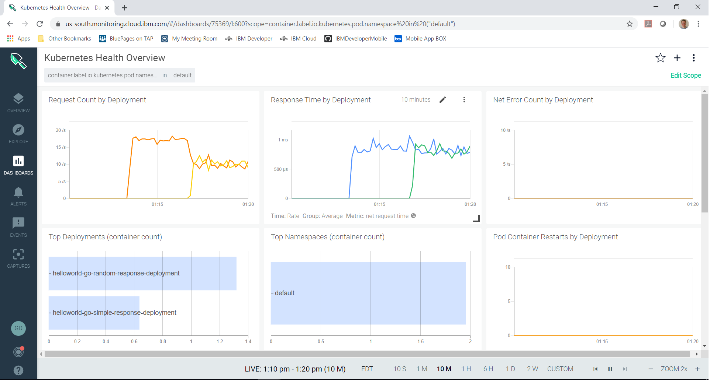

# Knative routing

[Knative](https://knative.dev/) is an open source platform that extends the capabilities of Kubernetes to help you create modern, source-centric containerized and serverless applications.
Knative integrates with Istio to ensure that your workloads can be easily exposed on the internet, monitored and controlled.
This tutorial focuses on these traffic management capabilities of Knative.


## Objectives

In this tutorial, you'll learn how to:
* Roll out a new revision of an application.
* Roll back to an earlier revision of an application.


## Prerequistes

This tutorial assumes that you completed the [Knative 101 Labs](https://github.com/IBM/knative101/tree/master/workshop),
which introduces the basic Knative concepts and provides instructions for creating an IBM Cloud Kubernetes Service cluster and installing Knative.
You will need the cluster to complete this tutorial.
Complete the following exercises if you have not already:
* [Install developer tools (ibmcloud, kubectl, kn)](https://github.com/IBM/knative101/tree/master/workshop/exercise-0)
* [Create a Kubernetes cluster on IBM Cloud](https://github.com/IBM/knative101/tree/master/workshop/exercise-1)
* [Install Knative and Istio on your cluster](https://github.com/IBM/knative101/tree/master/workshop/exercise-2)
* [Set up your private container registry](https://github.com/IBM/knative101/tree/master/workshop/exercise-6)

Also you need to have [Docker](https://docs.docker.com/get-docker/) installed.


## Deploy the sample application

A user can work with Knative in two different ways:
* By managing the low-level Knative resources (route, configuration, etc.) directly.
* By managing the high-level Knative service resource and letting Knative manage the underlying low-level resources.

For the purpose of getting started and keeping things simple, let's assume that we are using the latter approach.

This tutorial uses a helloworld sample program that was adapted from [this sample](https://github.com/knative/docs/tree/master/docs/serving/samples/hello-world/helloworld-go).

Clone this repository so that you can use it to build and deploy the same program.

```
git clone github.com/IBM/knative-routing-tutorial
cd knative-routing-tutorial
```

Build the first version of the helloworld-go sample program in the `helloworld1` directory and push it to your container registry.
Note that the image is given the tag `1` to indicate the first version of the program.
You will need to substitute the following values in these commands:
* `<APIKEY>` - the API key that you created in the Knative lab to access your registry.
* `<REGISTRY>` - the domain name of your container registry (e.g. `us.icr.io`).
* `<NAMESPACE>` - the name of your namespace in the registry that you created in the Knative lab.

```
docker login -u iamapikey -p <APIKEY> <REGISTRY>
docker build -f Dockerfile helloworld1 -t helloworld-go:1
docker tag helloworld:1 <REGISTRY>/<NAMESPACE>/helloworld-go:1
docker push <REGISTRY>/<NAMESPACE>/helloworld-go:1
```

We're going to deploy the helloworld-go program using the [helloworld1.yaml](helloworld1.yaml) file.
Let's take a look at the file.

```
apiVersion: serving.knative.dev/v1
kind: Service
metadata:
  name: helloworld-go
  namespace: default
spec:
  template:
    metadata:
      name: helloworld-go-simple-response
    spec:
      containers:
        - image: <REGISTRY>/<NAMESPACE>/helloworld-go:1
          env:
            - name: TARGET
              value: "Go Sample v1"
```

The configuration of the service is called a **revision**.
This revision is given the name `helloworld-go-simple-response`.

You must edit the helloworld1.yaml file to replace `<REGISTRY>` and `<NAMESPACE>` with the same values as you used when you pushed the image.
After you do that, apply the helloworld1.yaml file to your cluster.

```
kubectl apply -f helloworld1.yaml
```

It may take a minute for the program to be ready.
You can monitor the progress by displaying the service.

```
kubectl get ksvc helloworld-go
```

When the output shows the service is ready, you can continue.

```
NAME            URL                                                                                                                 LATESTCREATED                   LATESTREADY                     READY   REASON
helloworld-go   http://helloworld-go-default.mycluster6-f2c6cdc6801be85fd188b09d006f13e3-0000.us-south.containers.appdomain.cloud   helloworld-go-simple-response   helloworld-go-simple-response   True    
```

The above output tells us that the service hostname is
<br/>
&nbsp;&nbsp;`helloworld-go-default.mycluster6-f2c6cdc6801be85fd188b09d006f13e3-0000.us-south.containers.appdomain.cloud`.

The hostname for the service follows this general pattern:
<br/>
&nbsp;&nbsp;*service name*-*service namespace*.*ingress subdomain*

The *service name* and *service namespace* are determined from the service yaml file.
The *ingress subdomain* is a public URL providing access to your cluster. 
You may see a different name depending on what you named your cluster and where it is located.

Now you can curl the helloworld-go application.  Substitute your service name in the curl command below.

```
curl helloworld-go-default.mycluster6-f2c6cdc6801be85fd188b09d006f13e3-0000.us-south.containers.appdomain.cloud
```

You should see a response message, `Hello Go Sample v1!`


## Roll out of a new version of the application

Let's change the sample application to give back a more interesting response than the simple static message.

Build the second version of the helloworld-go sample program in the `helloworld2` directory and push it to your container registry.
You will need to replace `<REGISTRY>` with the domain name of your container registry (e.g. `us.icr.io`)
and `<NAMESPACE>` with the name of your namespace in the registry that you created in the Knative lab.
Note that the image is given the tag `2` to indicate the second version of the program.

```
docker build -f Dockerfile helloworld2 -t helloworld-go:2
docker tag helloworld:2 <REGISTRY>/<NAMESPACE>/helloworld-go:2
docker push <REGISTRY>/<NAMESPACE>/helloworld-go:2
```

We could just deploy the new version, by completely replacing the old version of the application.
However, at a certain point you may want to do a more gradual roll out of a new function to users.
This can be done by adding a `traffic` object to the service yaml file.

Here is the next yaml file we will use, [helloworld2.yaml](helloworld2.yaml).

```
apiVersion: serving.knative.dev/v1
kind: Service
metadata:
  name: helloworld-go
  namespace: default
spec:
  template:
    metadata:
      name: helloworld-go-random-response
    spec:
      containers:
        - image: <REGISTRY>/<NAMESPACE>/helloworld-go:2
  traffic:
  - tag: current
    revisionName: helloworld-go-simple-response
    percent: 50
  - tag: latest
    revisionName: helloworld-go-random-response
    percent: 50
```

In addition to changing the service's pod configuration to use a different image (the one tagged with `2`),
this file uses a new `traffic` object to route requests to different revisions.
In this case we want to divide traffic evenly between the previous revision we created `helloworld-go-simple-response` and the new revision we're creating `helloworld-go-random-response`.

You must edit the helloworld2.yaml file to replace `<REGISTRY>` and `<NAMESPACE>` with the same values as you used earlier.
After you do that, apply the helloworld2.yaml file to your cluster.

```
kubectl apply -f helloworld2.yaml
```

Watch for the new revision to become ready by using `kubectl get ksvc helloworld-go` as before.
When it is, confirm that the route is splitting traffic between the two revisions by using

```
kn route describe helloworld-go
```

You should see something like this:

```
Name:       helloworld-go
Namespace:  default
Age:        10m
URL:        http://helloworld-go-default.mycluster6-f2c6cdc6801be85fd188b09d006f13e3-0000.us-south.containers.appdomain.cloud
Service:    helloworld-go

Traffic Targets:  
   50%  helloworld-go-simple-response #current
        URL:  http://current-helloworld-go-default.mycluster6-f2c6cdc6801be85fd188b09d006f13e3-0000.us-south.containers.appdomain.cloud
   50%  helloworld-go-random-response #latest
        URL:  http://latest-helloworld-go-default.mycluster6-f2c6cdc6801be85fd188b09d006f13e3-0000.us-south.containers.appdomain.cloud

Conditions:  
  OK TYPE                  AGE REASON
  ++ Ready                  3m 
  ++ AllTrafficAssigned     10m
  ++ IngressReady           3m 
```

Try using `curl` again several times and you should see the response you saw from the first version and some new responses from the second version.

```
$ curl helloworld-go-default.mycluster6-f2c6cdc6801be85fd188b09d006f13e3-0000.us-south.containers.appdomain.cloud
Hello and have a wonderful day!

$ curl helloworld-go-default.mycluster6-f2c6cdc6801be85fd188b09d006f13e3-0000.us-south.containers.appdomain.cloud
Hello Go Sample v1!
```

When using the `traffic` object you can assign a `tag` to expose a dedicated URL that routes requests to that revision.
In the yaml file we used the tag `current` for the original revision and `latest` for the new revision.
You can prefix these tags to the service's domain name if you need to try out a specific revision.

```
$ curl current-helloworld-go-default.mycluster6-f2c6cdc6801be85fd188b09d006f13e3-0000.us-south.containers.appdomain.cloud
Hello Go Sample v1!
$ curl latest-helloworld-go-default.mycluster6-f2c6cdc6801be85fd188b09d006f13e3-0000.us-south.containers.appdomain.cloud
Hello and have a super day!
```

The use of `tag` is optional.


## Roll back to an earlier version of the application

What if you discover during your roll out testing that there's something wrong with the new revision of your service and you don't want to route users to it?
In that case you can edit the service using 

```
kubectl edit ksvc helloworld-go
```

An edit window appears containing the service's current yaml definition.
Find the `traffic` object (the one under `spec`, not the one under `status`) and change it so that the first revision gets 100% of the requests and the second revision gets 0% of the requests, as shown below.

```
  traffic:
  - latestRevision: false
    percent: 100
    revisionName: helloworld-go-simple-response
  - latestRevision: false
    percent: 0
    revisionName: helloworld-go-random-response
```

Save the updated yaml file and close the edit window.
All traffic now will be routed to the first revision.

```
$ curl helloworld-go-default.mycluster6-f2c6cdc6801be85fd188b09d006f13e3-0000.us-south.containers.appdomain.cloud
Hello Go Sample v1!

$ curl helloworld-go-default.mycluster6-f2c6cdc6801be85fd188b09d006f13e3-0000.us-south.containers.appdomain.cloud
Hello Go Sample v1!
```


## Roll forward to the latest version of the application

What if testing went well and you want to route all users to the new revision?
In that case you can edit the service's yaml and change the `traffic` object in any of the following ways:

* Change the `traffic` object so that the first revision gets 0% of the requests and the second revision gets 100% of the requests.
    ```
      traffic:
      - latestRevision: false
        percent: 0
        revisionName: helloworld-go-simple-response
      - latestRevision: false
        percent: 100
        revisionName: helloworld-go-random-response
    ```
* Change the `traffic` object to route all requests to the latest ready revision.
    ```
      traffic:
      - latestRevision: true
        percent: 100
    ```
* Delete the `traffic` object completely.  This causes knative to route all requests to the latest ready revision.

Save the updated yaml file and close the edit window.
All traffic now will be routed to the latest revision of the service.

```
$ curl helloworld-go-default.mycluster6-f2c6cdc6801be85fd188b09d006f13e3-0000.us-south.containers.appdomain.cloud
Hello and have a wonderful day!

$ curl helloworld-go-default.mycluster6-f2c6cdc6801be85fd188b09d006f13e3-0000.us-south.containers.appdomain.cloud
Hello and have a super day!
```


## Monitoring traffic using IBM Cloud Monitoring with Sysdig

We can use IBM Cloud Monitoring with Sysdig to observe traffic being routed to different revisions.

Please see [this tutorial](https://cloud.ibm.com/docs/Monitoring-with-Sysdig?topic=Sysdig-getting-started)
for instructions on provisioning an instance of IBM Cloud Monitoring with Sysdig and configuring your cluster to work with it.

After completing the tutorial, click on the `Dashboards` icon and find the `Kubernetes Health Overview` dashboard.
It is located in the `Kubernetes` section under `Default Dashboards`.
When you have opened the dashboard, complete the following steps:

* Click on the options <code>&#8942;</code> menu and select the `Copy Dashboard` option.
* Click the `Copy and Open` button.
* When the copied dashboard appears, click `Edit Scope`.
* Select `container.label.io.kubernetes.pod.namespace` in the first drop-down box.
* Select or type in `Default` in the value box.
* Click `Save`.

In a separate shell, run a loop of curl requests to the `helloworld-go` service as follows.

```
for i in `seq 1 5000`; do curl helloworld-go-default.mycluster6-f2c6cdc6801be85fd188b09d006f13e3-0000.us-south.containers.appdomain.cloud; done
```

Assuming that the Knative service is still set to route all requests to the latest revision,
the dashboard should show all requests going to the `helloworld-go-random-response` revision.
(You may have to click on the `10M` or `1M` button at the bottom of the window to see recent data.)



Try applying the `helloworld2.yaml` file again to split traffic between the two revisions.

```
kubectl apply -f helloworld2.yaml
```

The dashboard should show requests being split between the two revisions.


